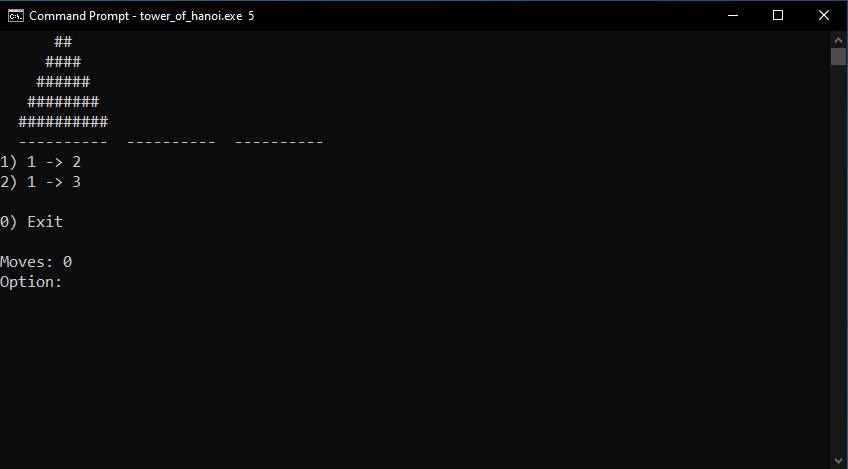

## The Tower of Hanoi

It is a very fun math game that will take your brain to another world. :blush: 
The goal of the game is to move all disks from the **first tower** to the **last one**.

- Language: **C++**
- IDE: **Codeblocks**
- Operating system: **Windows**

------------

